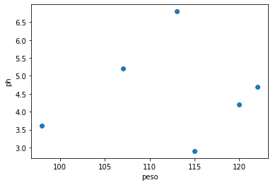

# Modelo Perceptron

 


Neste tutorial iremos elaborar um modelo de aprendizagem **Supervisionada** chamado perceptron simples. Iremos utilizar os dados do dataset iris, mais especificamente os dados de duas tipagem de plantas, a Iris Setosa e a Iris versicolor.Estamos utilizando dois dados de saída pois iremos fazer uma análise de classificação linear simples, ou seja, com a função de ativação degrau bipolar. Como estamos utilizando um regressão simples, iremos utilizar apenas duas características de entradas de dados. Comprimento da Sepala e Comprimento da Petala.


### Modelo:

<a href="https://imgur.com/HPRdoda"></a>

### Iris Data Set
### Informações dos dados:

```
0. sepal length in cm = Comprimento da Sepala [SepalLengthCm]
1. sepal width in cm  = Largura da Sepala [SepalWidthCm]
2. petal length in cm = Comprimento da Petala [PetalLengthCm]
3. petal width in cm  = Larguta da Petala [PetalWidthCm]

4. class:
-- Iris Setosa
-- Iris Versicolour
-- Iris Virginica
````

**Iremos utilizar:**

Iris Setosa 


```python
import numpy as np
import pandas as pd
import matplotlib.pyplot as plt
```


```python
# Carregando o conjunto iris dataset do link oficial
dataIris = pd.read_csv('https://raw.githubusercontent.com/Jonathan-geo/statistics-models/master/Iris.csv')
```


```python
dataIris[:5]
```


<div>
<style scoped>
    .dataframe tbody tr th:only-of-type {
        vertical-align: middle;
    }

    .dataframe tbody tr th {
        vertical-align: top;
    }

    .dataframe thead th {
        text-align: right;
    }
</style>
<table border="1" class="dataframe">
  <thead>
    <tr style="text-align: right;">
      <th></th>
      <th>Id</th>
      <th>SepalLengthCm</th>
      <th>SepalWidthCm</th>
      <th>PetalLengthCm</th>
      <th>PetalWidthCm</th>
      <th>Species</th>
    </tr>
  </thead>
  <tbody>
    <tr>
      <th>0</th>
      <td>1</td>
      <td>5.1</td>
      <td>3.5</td>
      <td>1.4</td>
      <td>0.2</td>
      <td>Iris-setosa</td>
    </tr>
    <tr>
      <th>1</th>
      <td>2</td>
      <td>4.9</td>
      <td>3.0</td>
      <td>1.4</td>
      <td>0.2</td>
      <td>Iris-setosa</td>
    </tr>
    <tr>
      <th>2</th>
      <td>3</td>
      <td>4.7</td>
      <td>3.2</td>
      <td>1.3</td>
      <td>0.2</td>
      <td>Iris-setosa</td>
    </tr>
    <tr>
      <th>3</th>
      <td>4</td>
      <td>4.6</td>
      <td>3.1</td>
      <td>1.5</td>
      <td>0.2</td>
      <td>Iris-setosa</td>
    </tr>
    <tr>
      <th>4</th>
      <td>5</td>
      <td>5.0</td>
      <td>3.6</td>
      <td>1.4</td>
      <td>0.2</td>
      <td>Iris-setosa</td>
    </tr>
  </tbody>
</table>
</div>


```python
dataIris=dataIris.drop(columns=['Id'])
```


```python
dataIris.shape
```


    (150, 5)


```python
dataIris
```


<div>
<style scoped>
    .dataframe tbody tr th:only-of-type {
        vertical-align: middle;
    }

    .dataframe tbody tr th {
        vertical-align: top;
    }

    .dataframe thead th {
        text-align: right;
    }
</style>
<table border="1" class="dataframe">
  <thead>
    <tr style="text-align: right;">
      <th></th>
      <th>SepalLengthCm</th>
      <th>SepalWidthCm</th>
      <th>PetalLengthCm</th>
      <th>PetalWidthCm</th>
      <th>Species</th>
    </tr>
  </thead>
  <tbody>
    <tr>
      <th>0</th>
      <td>5.1</td>
      <td>3.5</td>
      <td>1.4</td>
      <td>0.2</td>
      <td>Iris-setosa</td>
    </tr>
    <tr>
      <th>1</th>
      <td>4.9</td>
      <td>3.0</td>
      <td>1.4</td>
      <td>0.2</td>
      <td>Iris-setosa</td>
    </tr>
    <tr>
      <th>2</th>
      <td>4.7</td>
      <td>3.2</td>
      <td>1.3</td>
      <td>0.2</td>
      <td>Iris-setosa</td>
    </tr>
    <tr>
      <th>3</th>
      <td>4.6</td>
      <td>3.1</td>
      <td>1.5</td>
      <td>0.2</td>
      <td>Iris-setosa</td>
    </tr>
    <tr>
      <th>4</th>
      <td>5.0</td>
      <td>3.6</td>
      <td>1.4</td>
      <td>0.2</td>
      <td>Iris-setosa</td>
    </tr>
    <tr>
      <th>...</th>
      <td>...</td>
      <td>...</td>
      <td>...</td>
      <td>...</td>
      <td>...</td>
    </tr>
    <tr>
      <th>145</th>
      <td>6.7</td>
      <td>3.0</td>
      <td>5.2</td>
      <td>2.3</td>
      <td>Iris-virginica</td>
    </tr>
    <tr>
      <th>146</th>
      <td>6.3</td>
      <td>2.5</td>
      <td>5.0</td>
      <td>1.9</td>
      <td>Iris-virginica</td>
    </tr>
    <tr>
      <th>147</th>
      <td>6.5</td>
      <td>3.0</td>
      <td>5.2</td>
      <td>2.0</td>
      <td>Iris-virginica</td>
    </tr>
    <tr>
      <th>148</th>
      <td>6.2</td>
      <td>3.4</td>
      <td>5.4</td>
      <td>2.3</td>
      <td>Iris-virginica</td>
    </tr>
    <tr>
      <th>149</th>
      <td>5.9</td>
      <td>3.0</td>
      <td>5.1</td>
      <td>1.8</td>
      <td>Iris-virginica</td>
    </tr>
  </tbody>
</table>
<p>150 rows × 5 columns</p>
</div>


```python
# Obtendo o vetor de alvos [y]  Iris Setosa e Iris versicolor.
y = dataIris.iloc[0:100, 4].values
```


```python
y
```


    array(['Iris-setosa', 'Iris-setosa', 'Iris-setosa', 'Iris-setosa',
           'Iris-setosa', 'Iris-setosa', 'Iris-setosa', 'Iris-setosa',
           'Iris-setosa', 'Iris-setosa', 'Iris-setosa', 'Iris-setosa',
           'Iris-setosa', 'Iris-setosa', 'Iris-setosa', 'Iris-setosa',
           'Iris-setosa', 'Iris-setosa', 'Iris-setosa', 'Iris-setosa',
           'Iris-setosa', 'Iris-setosa', 'Iris-setosa', 'Iris-setosa',
           'Iris-setosa', 'Iris-setosa', 'Iris-setosa', 'Iris-setosa',
           'Iris-setosa', 'Iris-setosa', 'Iris-setosa', 'Iris-setosa',
           'Iris-setosa', 'Iris-setosa', 'Iris-setosa', 'Iris-setosa',
           'Iris-setosa', 'Iris-setosa', 'Iris-setosa', 'Iris-setosa',
           'Iris-setosa', 'Iris-setosa', 'Iris-setosa', 'Iris-setosa',
           'Iris-setosa', 'Iris-setosa', 'Iris-setosa', 'Iris-setosa',
           'Iris-setosa', 'Iris-setosa', 'Iris-versicolor', 'Iris-versicolor',
           'Iris-versicolor', 'Iris-versicolor', 'Iris-versicolor',
           'Iris-versicolor', 'Iris-versicolor', 'Iris-versicolor',
           'Iris-versicolor', 'Iris-versicolor', 'Iris-versicolor',
           'Iris-versicolor', 'Iris-versicolor', 'Iris-versicolor',
           'Iris-versicolor', 'Iris-versicolor', 'Iris-versicolor',
           'Iris-versicolor', 'Iris-versicolor', 'Iris-versicolor',
           'Iris-versicolor', 'Iris-versicolor', 'Iris-versicolor',
           'Iris-versicolor', 'Iris-versicolor', 'Iris-versicolor',
           'Iris-versicolor', 'Iris-versicolor', 'Iris-versicolor',
           'Iris-versicolor', 'Iris-versicolor', 'Iris-versicolor',
           'Iris-versicolor', 'Iris-versicolor', 'Iris-versicolor',
           'Iris-versicolor', 'Iris-versicolor', 'Iris-versicolor',
           'Iris-versicolor', 'Iris-versicolor', 'Iris-versicolor',
           'Iris-versicolor', 'Iris-versicolor', 'Iris-versicolor',
           'Iris-versicolor', 'Iris-versicolor', 'Iris-versicolor',
           'Iris-versicolor', 'Iris-versicolor', 'Iris-versicolor'],
          dtype=object)


```python
y.shape
```


    (100,)


```python
#Atribuindo um rótulo (numérico) as saídas. 
#Iris Setosa == -1 e Iris versicolorm 1. 
y = np.where(y == 'Iris-setosa', -1, 1)
```


```python
y
```


    array([-1, -1, -1, -1, -1, -1, -1, -1, -1, -1, -1, -1, -1, -1, -1, -1, -1,
           -1, -1, -1, -1, -1, -1, -1, -1, -1, -1, -1, -1, -1, -1, -1, -1, -1,
           -1, -1, -1, -1, -1, -1, -1, -1, -1, -1, -1, -1, -1, -1, -1, -1,  1,
            1,  1,  1,  1,  1,  1,  1,  1,  1,  1,  1,  1,  1,  1,  1,  1,  1,
            1,  1,  1,  1,  1,  1,  1,  1,  1,  1,  1,  1,  1,  1,  1,  1,  1,
            1,  1,  1,  1,  1,  1,  1,  1,  1,  1,  1,  1,  1,  1,  1])


```python
#Separendo a variável de entrada do modelo. Comprimento da sepala e da petala.
#SepalLengthCm
#PetalLengthCm
x = dataIris.iloc[0:100, [0, 2]].values
```


```python
x[0:10]
```


    array([[5.1, 1.4],
           [4.9, 1.4],
           [4.7, 1.3],
           [4.6, 1.5],
           [5. , 1.4],
           [5.4, 1.7],
           [4.6, 1.4],
           [5. , 1.5],
           [4.4, 1.4],
           [4.9, 1.5]])


```python
# Adicionando a coluna do bias (necessário em algoritmos baseados em perceptron/gradiente)
x = np.c_[np.ones(x.shape[0]), x]
```


```python
x[0:10]
```


    array([[1. , 5.1, 1.4],
           [1. , 4.9, 1.4],
           [1. , 4.7, 1.3],
           [1. , 4.6, 1.5],
           [1. , 5. , 1.4],
           [1. , 5.4, 1.7],
           [1. , 4.6, 1.4],
           [1. , 5. , 1.5],
           [1. , 4.4, 1.4],
           [1. , 4.9, 1.5]])


```python
x.shape
```


    (100, 3)


```python

```


```python
# Visualizando os dados (estamos pulando a coluna do bias)
plt.scatter(x[:50, 1], x[:50, 2],
            color='red', marker='o', label='setosa')

plt.scatter(x[50:100, 1], x[50:100, 2],
             color='blue', marker='x', label='versicolor')

plt.xlabel('largura da sépala [cm]')
plt.ylabel('largura da pétala [cm]')
plt.legend(loc='upper left') 
plt.show()
```


```python
#Dividindo o dataset em treino e teste. 
from sklearn import model_selection

# Split em conjunto de treino e teste
x_train, x_test, y_train, y_test = model_selection.train_test_split(x, y, test_size=0.2, random_state=0)
```


```python
x_train[:5]
```


    array([[1. , 5. , 1.6],
           [1. , 6. , 4. ],
           [1. , 4.6, 1.5],
           [1. , 6.1, 4. ],
           [1. , 4.8, 1.4]])


```python
x_train.shape
```


    (80, 3)


```python
y_train
```


    array([-1,  1, -1,  1, -1, -1, -1,  1,  1,  1,  1,  1,  1,  1,  1, -1, -1,
            1,  1,  1, -1,  1, -1, -1, -1, -1, -1, -1, -1, -1,  1,  1, -1, -1,
           -1,  1, -1, -1, -1,  1, -1, -1,  1,  1,  1,  1, -1,  1, -1,  1, -1,
           -1, -1,  1,  1,  1, -1,  1,  1,  1, -1, -1,  1, -1, -1,  1,  1, -1,
            1,  1,  1, -1, -1,  1, -1,  1,  1,  1, -1, -1])


```python
y_train.shape
```


    (80,)


```python
#Função do ŷ ou h
def h(x, thetas):
    #A função dot faz multiplicação de matriz
    #x.dot(thetas) é o mesmo que Σ(Xi.Wi)
    #a função where faz o papel da função degrau. Se o 
    #output de x.dot(thetas) for maior que 0.0 retorne 1
    #se for menor retorne -1. 
    return np.where(x.dot(thetas) >= 0.0, 1, -1)
```


```python
def perceptron(x, y, iterations, alpha):
    #Definindo os pesos = array([0., 0., 0.])
    thetas = np.zeros(x_train.shape[1])
    #Repetir por dez (por exemplo) vezes
    for i in range(iterations):
        #Para cada entrada x e saída y. 
        for xi, yi in zip(x_train, y_train):
            #Fórmula do perceptron para ajuste dos pesos
            # [w = w + α * Et . xi]
            # [Et = yi - ŷ]  para ŷ = h 
            # ŷ ou h (é o y estimado, ou seja, )
            thetas = thetas + alpha * (yi - h(xi, thetas)) * xi
    return thetas
```


```python
# Treinando nosso modelo...
#Iterações
iterations = 10 
#Coef-Aprend
alpha = 0.01
#Chamada-Func
#Thetas é o mesmo que pesos ou w
thetas = perceptron(x_train, y_train, iterations, alpha)
```


```python
#Pesos de W balanceados. (Uma analogia com a 'Equação da reta')
thetasFinal = thetas
print(thetasFinal)
```

    [-0.04  -0.112  0.216]
    


```python
x_test.shape
```


    (20, 3)


```python
x_test
```


    array([[1. , 5. , 1.6],
           [1. , 6.7, 4.7],
           [1. , 4.7, 1.3],
           [1. , 5.7, 4.5],
           [1. , 6.6, 4.4],
           [1. , 5. , 3.3],
           [1. , 5.4, 1.3],
           [1. , 6.1, 4.7],
           [1. , 6.5, 4.6],
           [1. , 5.7, 4.2],
           [1. , 5.5, 4. ],
           [1. , 5.8, 4. ],
           [1. , 6. , 4.5],
           [1. , 4.3, 1.1],
           [1. , 5. , 1.5],
           [1. , 4.8, 1.6],
           [1. , 4.6, 1. ],
           [1. , 4.8, 1.9],
           [1. , 5.5, 1.4],
           [1. , 4.4, 1.4]])


```python
y_test
```


    array([-1,  1, -1,  1,  1,  1, -1,  1,  1,  1,  1,  1,  1, -1, -1, -1, -1,
           -1, -1, -1])


```python
#Teste
def hFinal(x_test, thetasFinal):
  return np.where(x_test.dot(thetasFinal) >= 0.0, 1, -1)
```


```python
y_est = hFinal(x_test, thetasFinal)
```


```python
#Acertos
y_est == y_test
```


    array([ True,  True,  True,  True,  True,  True,  True,  True,  True,
            True,  True,  True,  True,  True,  True,  True,  True,  True,
            True,  True])


## Considerações Finais

Podemos observar que ao descobrir os pesos balanceados [-0.04  -0.112  0.216] o modelo pode acertar todoas as nossos dados de teste. 

Referencias:

- Python Machine Learn - Sebastian Raschka https://www.amazon.com.br/Python-Machine-Learning-Sebastian-Raschka/dp/1789955750/ref=pd_sbs_14_t_0/146-7290337-7783406?_encoding=UTF8&pd_rd_i=1789955750&pd_rd_r=5750d573-f6c1-4f84-acf3-a26698a9fa4c&pd_rd_w=RXeqA&pd_rd_wg=5MTyX&pf_rd_p=adb10074-dc46-4d48-9abd-ebbbd99776aa&pf_rd_r=5X5JXYVPCJ010JQ0EEV3&psc=1&refRID=5X5JXYVPCJ010JQ0EEV3

- http://wiki.icmc.usp.br/images/7/7b/Perceptron.pdf

- https://juliocprocha.blog/2017/07/27/perceptron-para-classificacao-passo-a-passo/

# Perceptron Simples - Modelo II

Neste segundo modelo iremos fazer o uso de um modo mais manual de elaboração, neste sentido poderemos ver com mais detalhe o funcionamento do algorítmo Perceptron.


```python
import numpy as np
import matplotlib.pyplot as plt
```


```python
#Criando um array de valores x1 
peso = np.array([113, 98, 107, 122, 115, 120])
peso
```


    array([113,  98, 107, 122, 115, 120])


```python
#Criando um array de valores x2
ph = np.array([6.8, 3.6, 5.2, 4.7, 2.9, 4.2])
ph
```


    array([6.8, 3.6, 5.2, 4.7, 2.9, 4.2])


```python
# Unindo os atributos em uma matriz (X)
X = np.vstack((peso, ph))
X
```


    array([[113. ,  98. , 107. , 122. , 115. , 120. ],
           [  6.8,   3.6,   5.2,   4.7,   2.9,   4.2]])


```python
X.shape
```


    (2, 6)


## Métodos de Seleção de dado em Array


```python
X
```


    array([[113. ,  98. , 107. , 122. , 115. , 120. ],
           [  6.8,   3.6,   5.2,   4.7,   2.9,   4.2]])


```python
X[:1, :3]
```


    array([[113.,  98., 107.]])


```python
X[1:2, :3]
```


    array([[6.8, 3.6, 5.2]])


```python
X[:1, 3:]
```


    array([[122., 115., 120.]])


```python
X[1:2, 3:]
```


    array([[4.7, 2.9, 4.2]])


## Visualização dos Dados


```python
# Visualizando os dados (estamos pulando a coluna do bias)
plt.scatter(X[:1, :3], X[1:2, :3],
color='red', marker='o', label='Valores -1')

plt.scatter(X[:1, 3:], X[1:2, 3:],
color='blue', marker='x', label='Valores 1')

plt.xlabel('peso')
plt.ylabel('ph')
plt.legend(loc='upper left')
plt.show()
```


```python
# Visualização Simples
plt.scatter(X[0], X[1])
plt.xlabel('peso')
plt.ylabel('ph')
plt.show()
```





## Preparando o Algoritmo 


```python
# Resultados esperados (Y)
y = np.array([-1, -1, -1, 1, 1, 1])
y
```


    array([-1, -1, -1,  1,  1,  1])


```python
# Vetor de Pesos (Treino)
W = np.zeros([1,3])
W
```


    array([[0., 0., 0.]])


```python
# Array para armazenar os erros
e = np.zeros(12)
e
```


    array([0., 0., 0., 0., 0., 0., 0., 0., 0., 0., 0., 0.])


```python
def funcaoAtivacao(valor):
  # Função de ativação (degrau bipolar)
  if valor < 0.0:
    return (-1)
  else:
    return (1)
```


```python
# Define o número de épocas (repetições).
numEpocas = 2

# Número de linhas a percorrer (relativo ao tamanho do dataset)
# X.shape retorno o shape do dataset (2,6) 
q = X.shape[1]

# Theta 
bias = 1


# n = eta = Taxa de aprendizado
eta = 0.1


for j in range(numEpocas): # Repetir relativo ao numero de epocas
  for k in range(q): # Para cada época repetir todas as 6 "linhas" 
    # insere o bias no vetor de entrada (para cada repetição)
    xb = np.hstack((bias, X[:,k]))
    print("este é o xb(inserindo Bias no vetor de entrada)...............", xb)
    print("este é o W(vetor de pesos)....................................", W)

    # Calcular o campo induzido (Multiplicação Vetorial)
    V = np.dot(W, xb)
    print("este é o V(multiplicação/soma vetorial (pesos x entradas))....", V)
    


    # Calcular a saída perseptron 
    Yr = funcaoAtivacao(V)
    print("este é o Yr(pega o V e passa pela função ativação)............", Yr)


    # Calculo do erro: e = (Y - Yr)
    e[k] = y[k] - Yr
    print("este é o y[k](Valor de Y real (Yr))...........................", y[k])
    print("este é o e[k](Cálculo do erro (Y - Yr)).......................", e[k])


    # Treinamento do Perceptron
    W = W + eta*e[k]*xb
    print("este é o W(pesos corrigido (W = W + eta*e[k]*xb)).............", W)
    print("")
    print("-------------------------------loop---------------------------------")
    print("")
print("vetor de erros (e) = " + str(e))
```

    este é o xb(inserindo Bias no vetor de entrada)............... [  1.  113.    6.8]
    este é o W(vetor de pesos).................................... [[0. 0. 0.]]
    este é o V(multiplicação/soma vetorial (pesos x entradas)).... [0.]
    este é o Yr(pega o V e passa pela função ativação)............ 1
    este é o y[k](Valor de Y real (Yr))........................... -1
    este é o e[k](Cálculo do erro (Y - Yr))....................... -2.0
    este é o W(pesos corrigido (W = W + eta*e[k]*xb))............. [[ -0.2  -22.6   -1.36]]
    
    -------------------------------loop---------------------------------
    
    este é o xb(inserindo Bias no vetor de entrada)............... [ 1.  98.   3.6]
    este é o W(vetor de pesos).................................... [[ -0.2  -22.6   -1.36]]
    este é o V(multiplicação/soma vetorial (pesos x entradas)).... [-2219.896]
    este é o Yr(pega o V e passa pela função ativação)............ -1
    este é o y[k](Valor de Y real (Yr))........................... -1
    este é o e[k](Cálculo do erro (Y - Yr))....................... 0.0
    este é o W(pesos corrigido (W = W + eta*e[k]*xb))............. [[ -0.2  -22.6   -1.36]]
    
    -------------------------------loop---------------------------------
    
    este é o xb(inserindo Bias no vetor de entrada)............... [  1.  107.    5.2]
    este é o W(vetor de pesos).................................... [[ -0.2  -22.6   -1.36]]
    este é o V(multiplicação/soma vetorial (pesos x entradas)).... [-2425.472]
    este é o Yr(pega o V e passa pela função ativação)............ -1
    este é o y[k](Valor de Y real (Yr))........................... -1
    este é o e[k](Cálculo do erro (Y - Yr))....................... 0.0
    este é o W(pesos corrigido (W = W + eta*e[k]*xb))............. [[ -0.2  -22.6   -1.36]]
    
    -------------------------------loop---------------------------------
    
    este é o xb(inserindo Bias no vetor de entrada)............... [  1.  122.    4.7]
    este é o W(vetor de pesos).................................... [[ -0.2  -22.6   -1.36]]
    este é o V(multiplicação/soma vetorial (pesos x entradas)).... [-2763.792]
    este é o Yr(pega o V e passa pela função ativação)............ -1
    este é o y[k](Valor de Y real (Yr))........................... 1
    este é o e[k](Cálculo do erro (Y - Yr))....................... 2.0
    este é o W(pesos corrigido (W = W + eta*e[k]*xb))............. [[ 0.    1.8  -0.42]]
    
    -------------------------------loop---------------------------------
    
    este é o xb(inserindo Bias no vetor de entrada)............... [  1.  115.    2.9]
    este é o W(vetor de pesos).................................... [[ 0.    1.8  -0.42]]
    este é o V(multiplicação/soma vetorial (pesos x entradas)).... [205.782]
    este é o Yr(pega o V e passa pela função ativação)............ 1
    este é o y[k](Valor de Y real (Yr))........................... 1
    este é o e[k](Cálculo do erro (Y - Yr))....................... 0.0
    este é o W(pesos corrigido (W = W + eta*e[k]*xb))............. [[ 0.    1.8  -0.42]]
    
    -------------------------------loop---------------------------------
    
    este é o xb(inserindo Bias no vetor de entrada)............... [  1.  120.    4.2]
    este é o W(vetor de pesos).................................... [[ 0.    1.8  -0.42]]
    este é o V(multiplicação/soma vetorial (pesos x entradas)).... [214.236]
    este é o Yr(pega o V e passa pela função ativação)............ 1
    este é o y[k](Valor de Y real (Yr))........................... 1
    este é o e[k](Cálculo do erro (Y - Yr))....................... 0.0
    este é o W(pesos corrigido (W = W + eta*e[k]*xb))............. [[ 0.    1.8  -0.42]]
    
    -------------------------------loop---------------------------------
    
    este é o xb(inserindo Bias no vetor de entrada)............... [  1.  113.    6.8]
    este é o W(vetor de pesos).................................... [[ 0.    1.8  -0.42]]
    este é o V(multiplicação/soma vetorial (pesos x entradas)).... [200.544]
    este é o Yr(pega o V e passa pela função ativação)............ 1
    este é o y[k](Valor de Y real (Yr))........................... -1
    este é o e[k](Cálculo do erro (Y - Yr))....................... -2.0
    este é o W(pesos corrigido (W = W + eta*e[k]*xb))............. [[ -0.2  -20.8   -1.78]]
    
    -------------------------------loop---------------------------------
    
    este é o xb(inserindo Bias no vetor de entrada)............... [ 1.  98.   3.6]
    este é o W(vetor de pesos).................................... [[ -0.2  -20.8   -1.78]]
    este é o V(multiplicação/soma vetorial (pesos x entradas)).... [-2045.008]
    este é o Yr(pega o V e passa pela função ativação)............ -1
    este é o y[k](Valor de Y real (Yr))........................... -1
    este é o e[k](Cálculo do erro (Y - Yr))....................... 0.0
    este é o W(pesos corrigido (W = W + eta*e[k]*xb))............. [[ -0.2  -20.8   -1.78]]
    
    -------------------------------loop---------------------------------
    
    este é o xb(inserindo Bias no vetor de entrada)............... [  1.  107.    5.2]
    este é o W(vetor de pesos).................................... [[ -0.2  -20.8   -1.78]]
    este é o V(multiplicação/soma vetorial (pesos x entradas)).... [-2235.056]
    este é o Yr(pega o V e passa pela função ativação)............ -1
    este é o y[k](Valor de Y real (Yr))........................... -1
    este é o e[k](Cálculo do erro (Y - Yr))....................... 0.0
    este é o W(pesos corrigido (W = W + eta*e[k]*xb))............. [[ -0.2  -20.8   -1.78]]
    
    -------------------------------loop---------------------------------
    
    este é o xb(inserindo Bias no vetor de entrada)............... [  1.  122.    4.7]
    este é o W(vetor de pesos).................................... [[ -0.2  -20.8   -1.78]]
    este é o V(multiplicação/soma vetorial (pesos x entradas)).... [-2546.166]
    este é o Yr(pega o V e passa pela função ativação)............ -1
    este é o y[k](Valor de Y real (Yr))........................... 1
    este é o e[k](Cálculo do erro (Y - Yr))....................... 2.0
    este é o W(pesos corrigido (W = W + eta*e[k]*xb))............. [[ 0.    3.6  -0.84]]
    
    -------------------------------loop---------------------------------
    
    este é o xb(inserindo Bias no vetor de entrada)............... [  1.  115.    2.9]
    este é o W(vetor de pesos).................................... [[ 0.    3.6  -0.84]]
    este é o V(multiplicação/soma vetorial (pesos x entradas)).... [411.564]
    este é o Yr(pega o V e passa pela função ativação)............ 1
    este é o y[k](Valor de Y real (Yr))........................... 1
    este é o e[k](Cálculo do erro (Y - Yr))....................... 0.0
    este é o W(pesos corrigido (W = W + eta*e[k]*xb))............. [[ 0.    3.6  -0.84]]
    
    -------------------------------loop---------------------------------
    
    este é o xb(inserindo Bias no vetor de entrada)............... [  1.  120.    4.2]
    este é o W(vetor de pesos).................................... [[ 0.    3.6  -0.84]]
    este é o V(multiplicação/soma vetorial (pesos x entradas)).... [428.472]
    este é o Yr(pega o V e passa pela função ativação)............ 1
    este é o y[k](Valor de Y real (Yr))........................... 1
    este é o e[k](Cálculo do erro (Y - Yr))....................... 0.0
    este é o W(pesos corrigido (W = W + eta*e[k]*xb))............. [[ 0.    3.6  -0.84]]
    
    -------------------------------loop---------------------------------
    
    vetor de erros (e) = [-2.  0.  0.  2.  0.  0.  0.  0.  0.  0.  0.  0.]
    
